# azure-hcp-terraform-vcs

Deploy Azure infrastructure with Terraform using a GitHub VCS-backed HCP Terraform workspace.

This repository provisions a small Azure lab environment made up of a resource group, virtual network, subnet, public IP address, network interface, network security group, and Ubuntu Linux virtual machine. The screenshots in this guide were captured during the project setup on June 4, 2026 and show the full flow from GitHub repository creation to HCP Terraform runs and cleanup.

## Architecture

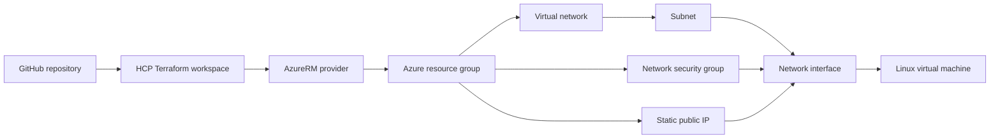

## What Gets Created

| Terraform resource | Purpose |
| --- | --- |
| `azurerm_resource_group.rg` | Container for all demo resources |
| `azurerm_virtual_network.vnet` | Azure virtual network |
| `azurerm_subnet.subnet` | Subnet inside the virtual network |
| `azurerm_network_security_group.nsg` | Allows inbound SSH traffic on port 22 |
| `azurerm_public_ip.public_ip` | Static public IP for the VM |
| `azurerm_network_interface.nic` | VM network interface |
| `azurerm_network_interface_security_group_association.nsg_association` | Attaches the NSG to the NIC |
| `azurerm_linux_virtual_machine.vm` | Ubuntu 24.04 LTS virtual machine |

The HCP Terraform plan captured in the screenshots shows 8 resources planned and created.

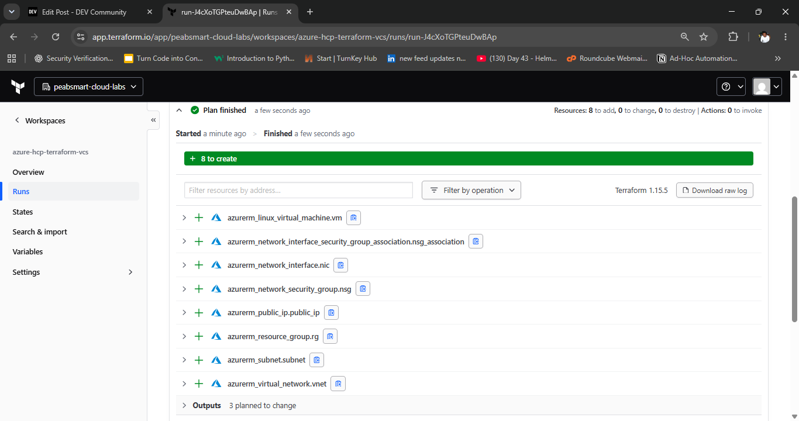

## Repository Structure

```text
.
|-- main.tf              # Azure resources
|-- providers.tf         # Terraform and AzureRM provider requirements
|-- variables.tf         # Input variable declarations
|-- outputs.tf           # Resource group, VM name, and public IP outputs
|-- .gitignore           # Ignores state, .terraform, tfvars, and local files
|-- docs/images/         # Screenshots used by this README
|-- LICENSE
`-- README.md
```

## Prerequisites

- GitHub account and repository access.
- HCP Terraform account and organization.
- Azure subscription.
- Azure identity or app registration with permission to create the resources in this configuration.
- Terraform CLI `>= 1.6.0` for local validation.
- SSH public key for VM login.

The project was validated locally with Terraform `1.15.5` and AzureRM provider `4.75.0`.

## GitHub Setup

Create a GitHub repository named `azure-hcp-terraform-vcs`. The original setup used a public repository, added a Terraform `.gitignore`, added a README, and selected the MIT license.

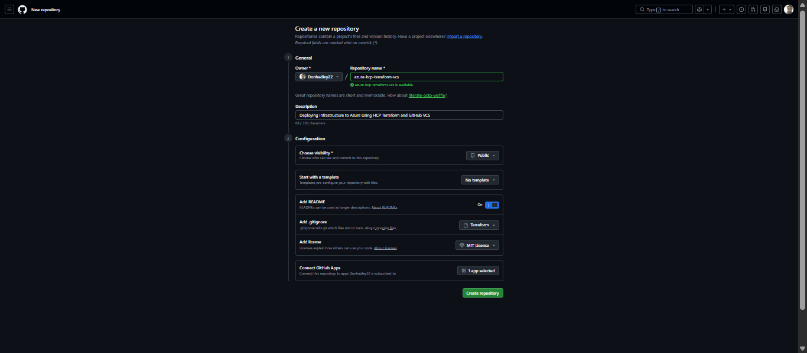

Clone the repository locally, add the Terraform files, commit them, and push to GitHub.

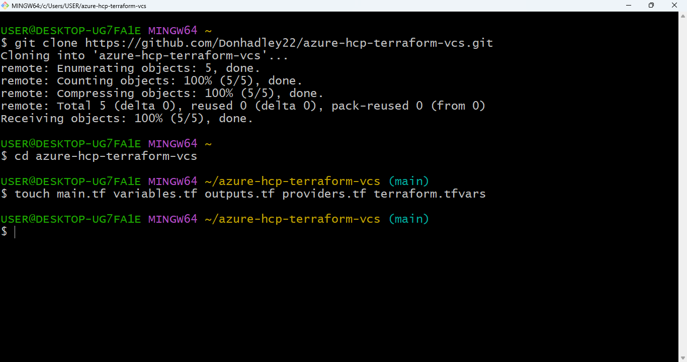

The pushed repository should contain the Terraform configuration files.

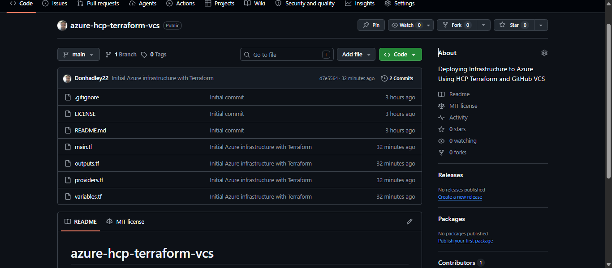

## Terraform Configuration

The provider block in `providers.tf` pins the AzureRM provider to the `4.x` major version:

```hcl
terraform {
  required_version = ">= 1.6.0"

  required_providers {
    azurerm = {
      source  = "hashicorp/azurerm"
      version = "~> 4.0"
    }
  }
}

provider "azurerm" {
  features {}
}
```

The main configuration creates a public Ubuntu VM:

- VM size: `Standard_D2s_v3`
- OS image: Canonical Ubuntu 24.04 LTS
- OS disk: `Standard_LRS`
- Public IP: static, Standard SKU
- SSH: allowed inbound on TCP port `22`

> Security note: this lab currently allows SSH from any source address. For production or long-running environments, restrict `source_address_prefix` to a trusted IP range, use Azure Bastion, or remove the public IP path.

## Input Variables

| Variable | Type | Example value | Description |
| --- | --- | --- | --- |
| `resource_group_name` | `string` | `rg-hcp-terraform-demo` | Azure resource group name |
| `location` | `string` | `westeurope` | Azure region |
| `vnet_name` | `string` | `vnet-hcp-demo` | Virtual network name |
| `vnet_address_space` | `list(string)` | `["10.0.0.0/16"]` | VNet CIDR range |
| `subnet_name` | `string` | `subnet-hcp-demo` | Subnet name |
| `subnet_address_prefixes` | `list(string)` | `["10.0.1.0/24"]` | Subnet CIDR range |
| `vm_name` | `string` | `vm-hcp-demo` | Linux VM name |
| `admin_username` | `string` | `azureuser` | VM admin username |
| `public_key` | `string` | `ssh-rsa ...` | SSH public key content |

For local runs, create a `terraform.tfvars` file. This file is ignored by Git because it can contain environment-specific values and sensitive material.

```hcl
resource_group_name     = "rg-hcp-terraform-demo"
location                = "westeurope"
vnet_name               = "vnet-hcp-demo"
vnet_address_space      = ["10.0.0.0/16"]
subnet_name             = "subnet-hcp-demo"
subnet_address_prefixes = ["10.0.1.0/24"]
vm_name                 = "vm-hcp-demo"
admin_username          = "azureuser"
public_key              = "ssh-rsa REPLACE_WITH_YOUR_PUBLIC_KEY"
```

## HCP Terraform Project

In HCP Terraform, create a project for the training resources. The captured project name was `Azure-Training-Projects`.

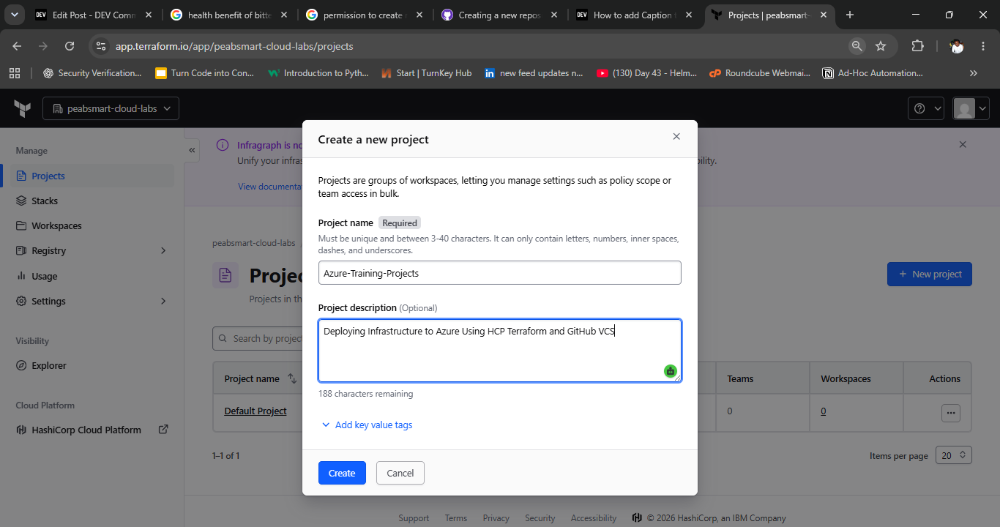

Optionally add tags to describe the project or environment.

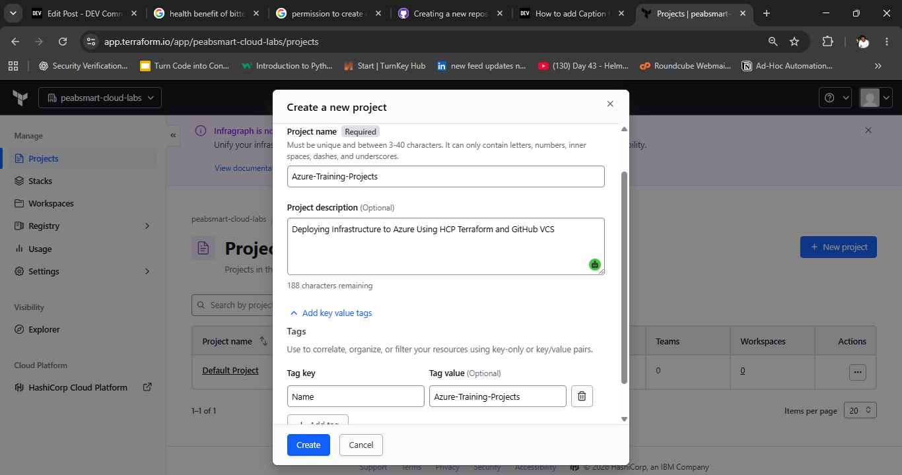

After creation, the project appears in the HCP Terraform project list.

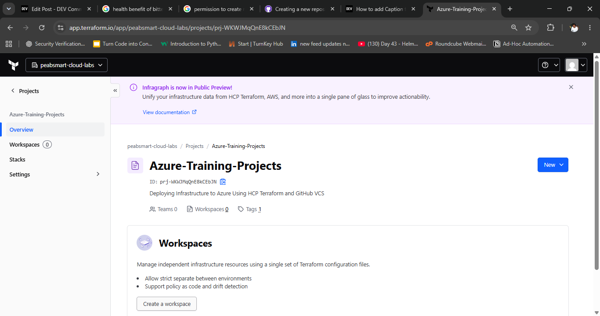

## HCP Terraform Workspace

Create a workspace connected to the GitHub repository. The captured workspace was named `azure-hcp-terraform-vcs`.

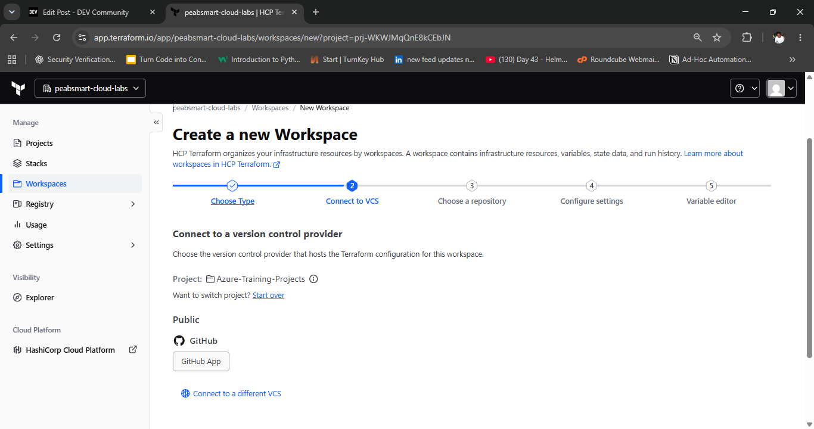

Configure the workspace settings and select the repository branch HCP Terraform should track.

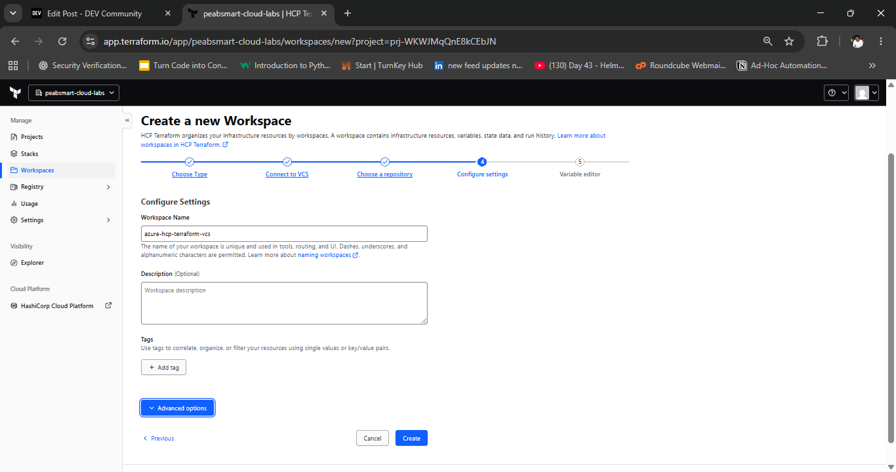

When HCP Terraform reads the repository, it detects the required Terraform input variables from `variables.tf`.

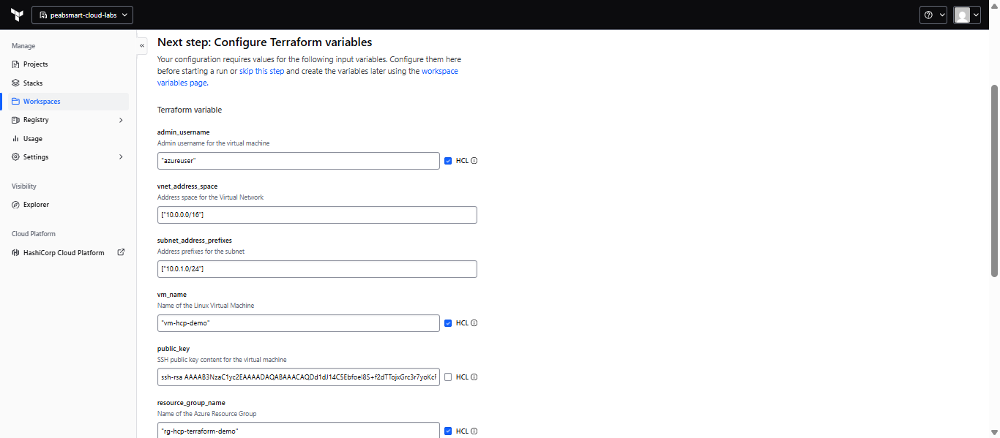

## Workspace Variables

Add the Terraform input variables in the workspace. For list values, enable HCL so values such as `["10.0.0.0/16"]` and `["10.0.1.0/24"]` are interpreted correctly.

Recommended Terraform variable settings:

| Key | Category | HCL | Sensitive |
| --- | --- | --- | --- |
| `admin_username` | Terraform variable | Yes | No |
| `location` | Terraform variable | Yes | No |
| `resource_group_name` | Terraform variable | Yes | No |
| `subnet_address_prefixes` | Terraform variable | Yes | No |
| `subnet_name` | Terraform variable | Yes | No |
| `vm_name` | Terraform variable | Yes | No |
| `vnet_address_space` | Terraform variable | Yes | No |
| `vnet_name` | Terraform variable | Yes | No |
| `public_key` | Terraform variable | No | Yes |

Add Azure authentication values as environment variables and mark them sensitive.

| Key | Category | Sensitive |
| --- | --- | --- |
| `ARM_CLIENT_ID` | Environment variable | Yes |
| `ARM_CLIENT_SECRET` | Environment variable | Yes |
| `ARM_SUBSCRIPTION_ID` | Environment variable | Yes |
| `ARM_TENANT_ID` | Environment variable | Yes |

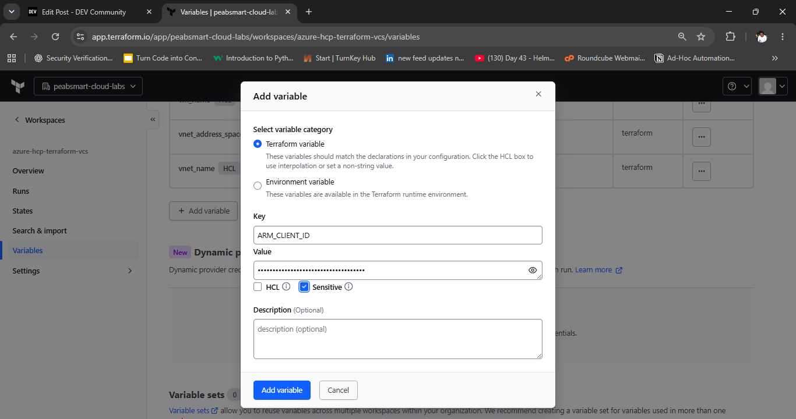

The final workspace variables page should include both Terraform input variables and Azure authentication environment variables.

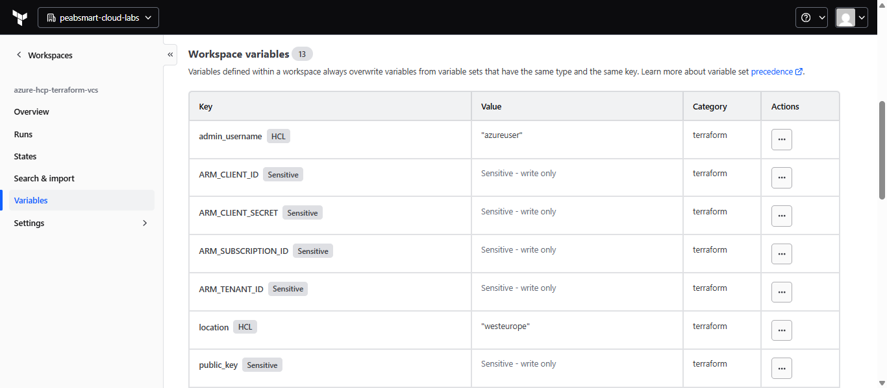

The captured setup also shows the Azure credentials listed as environment variables and marked sensitive.

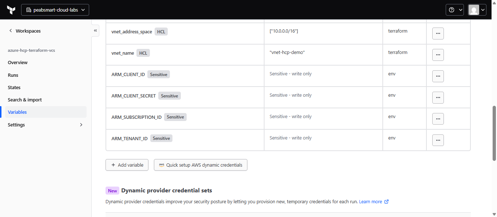

## Run Workflow

After the workspace is connected and variables are configured, HCP Terraform uploads the configuration from GitHub and starts a run.

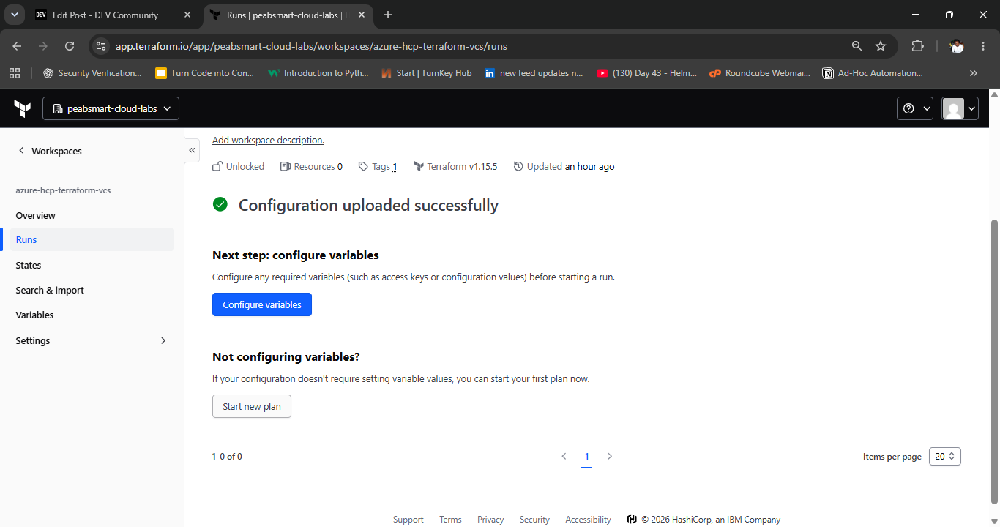

Review the plan carefully before applying. The captured plan showed 8 resources to create and 3 outputs.


Confirm and apply the run only after checking the resource list and expected outputs.

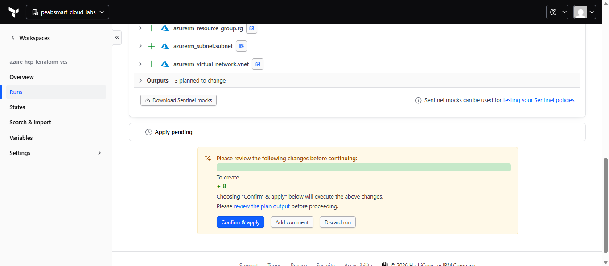

Once the apply completes, HCP Terraform shows all 8 resources as created. The outputs include:

- `public_ip_address`
- `resource_group_name`
- `vm_name`

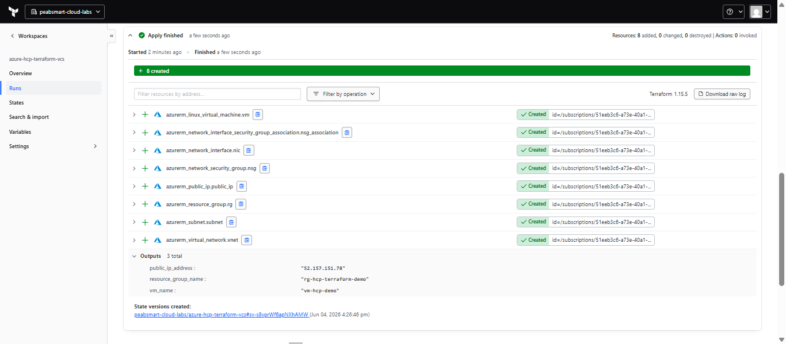

The run confirmation records the approval comment and confirms the desired state was applied.

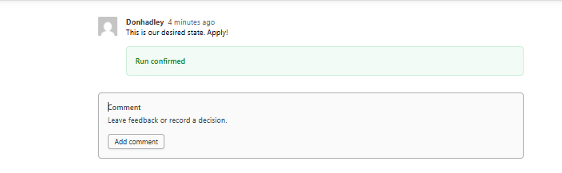

## Verify in Azure

Open the Azure Portal and navigate to the resource group. The captured deployment created the following visible resources:

- `vm-hcp-demo`
- `vm-hcp-demo-nic`
- `vm-hcp-demo-nsg`
- `vm-hcp-demo-osdisk`
- `vm-hcp-demo-public-ip`
- `vnet-hcp-demo`

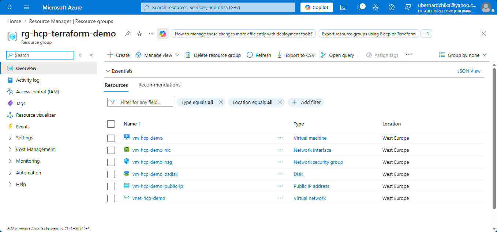

## Local Terraform Commands

You can also validate the configuration locally:

```powershell
terraform init
terraform fmt -check
terraform validate
terraform plan
```

For local Azure authentication, sign in with Azure CLI or set the required Azure environment variables before running `terraform plan` or `terraform apply`.

```powershell
az login
az account set --subscription "<subscription-id>"
```

## Destroy Workflow

To remove the infrastructure from HCP Terraform, open the workspace settings and go to **Destruction and deletion**. Enable destroy plans if needed, then queue a destroy plan.

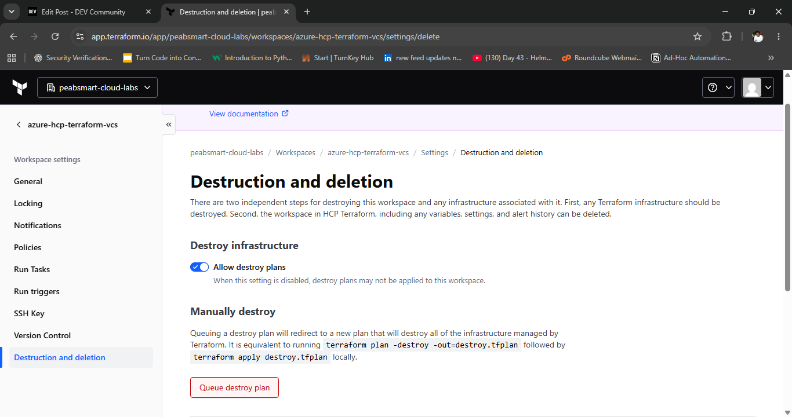

HCP Terraform asks for confirmation before queuing the destroy plan. Type `delete` to continue.

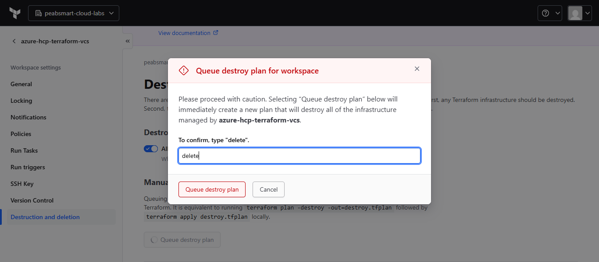

Review the destroy plan. The captured destroy plan showed 8 resources planned for destruction.

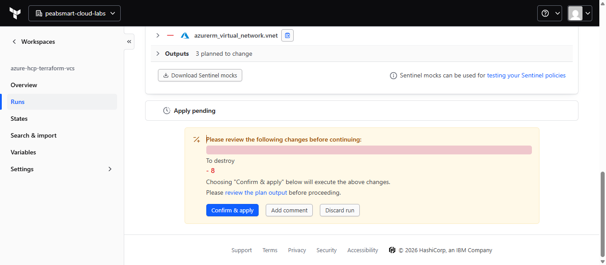

After confirmation, HCP Terraform destroys the managed Azure resources and records a new state version.

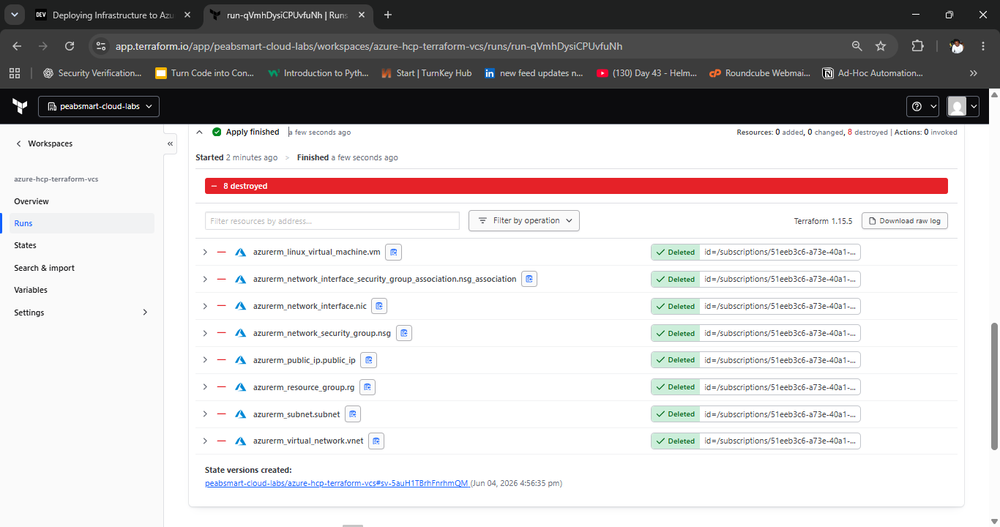

## Outputs

| Output | Description |
| --- | --- |
| `resource_group_name` | Name of the created Azure resource group |
| `public_ip_address` | Public IP address assigned to the virtual machine |
| `vm_name` | Name of the Linux virtual machine |

## Good Practices for This Project

- Commit `.terraform.lock.hcl` after running `terraform init` so provider selections are reproducible.
- Keep `terraform.tfvars`, state files, secrets, and private keys out of Git.
- Add a `terraform.tfvars.example` file for non-sensitive sample values.
- Restrict SSH access instead of allowing `source_address_prefix = "*"`.
- Pin the Ubuntu image version instead of using `version = "latest"` if reproducibility is important.
- Add variable validation for Azure regions, CIDR ranges, usernames, and SSH public key format.

## Screenshot Index

| Step | Screenshot |
| --- | --- |
| GitHub repository creation |  |
| Git clone and push |  |
| Terraform files in terminal | 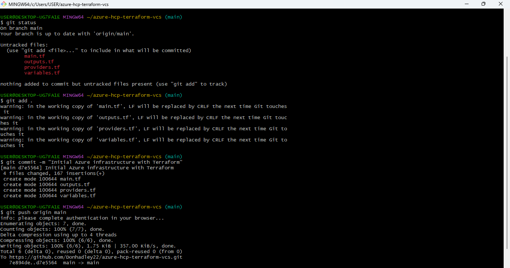 |
| GitHub repository files |  |
| Azure app registration | 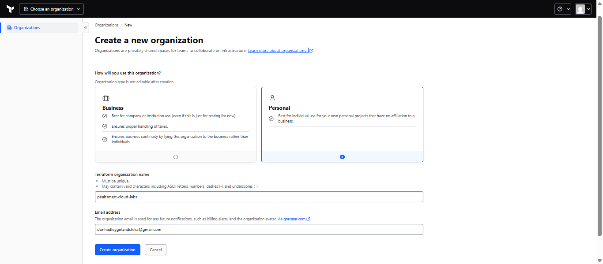 |
| HCP project creation |  |
| HCP project tags |  |
| HCP project created |  |
| HCP VCS workspace |  |
| Workspace configuration |  |
| Terraform input variables |  |
| Azure variable entry |  |
| Workspace variables |  |
| Azure environment variables |  |
| Configuration upload |  |
| Plan result |  |
| Apply confirmation |  |
| Apply completed |  |
| Run confirmed |  |
| Azure Portal resources |  |
| Destruction settings |  |
| Queue destroy plan |  |
| Destroy confirmation |  |
| Destroy completed |  |
